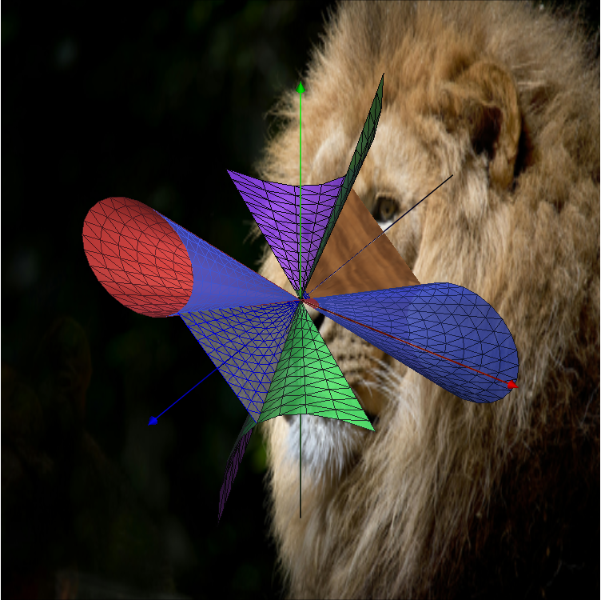

# OpenGL (GLAUX) Demo Project

Учебный проект на C++ / Visual Studio с использованием старых OpenGL + GLAUX библиотек.

## Требования
- Visual Studio 2019 или новее
- Windows SDK (устанавливается вместе с Visual Studio)
- Git (для клонирования проекта)

## Содержимое
- `include/GL/` — заголовочные файлы (`gl.h`, `glu.h`, `glaux.h` и т.д.)
- `lib/` — статические библиотеки (`opengl32.lib`, `glu32.lib`, `glaux.lib`)
- `Project0.cpp` — пример кода, рисующий оси и конусы
- `.sln` и `.vcxproj` — файлы проекта Visual Studio

## Сборка и запуск
1. Открой .sln в Visual Studio.
В меню:

- Configuration: Debug (или Release)

- Platform: `x86` (Win32)
⚠️ glaux не поддерживается под x64, поэтому проект нужно собирать под 32-бита.

2. Убедись, что пути настроены:

- Project → Properties → C/C++ → General → Additional Include Directories: $(SolutionDir)include

- Project → Properties → Linker → General → Additional Library Directories: $(SolutionDir)lib